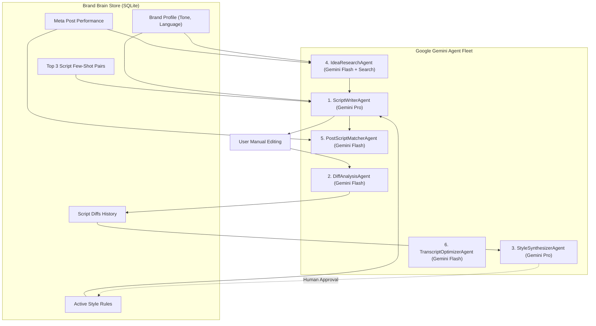

# AGENTS SPECIFICATION: Agncy

**Status:** Approved Specification  
**Project:** Agncy (Personal Content Agency Workspace)  
**AI Runtime:** Google Gemini API (`@google/genai` SDK)  
**Supported Models:**  
- **Gemini 2.5 / 1.5 Pro:** High-reasoning tasks (Script generation, style rule synthesis)  
- **Gemini 2.5 / 1.5 Flash:** High-speed tasks (Diff analysis, trend research, fuzzy post matching, transcript optimization)  
**Last Updated:** September 29, 2026  

---

## 1. Agent Architecture & Orchestration

Agncy utilizes specialized, decoupled agents rather than a single monolithic prompt. Each agent has an isolated directive, explicit input/output schemas, and strict deterministic guardrails.



---

## 2. Agent Fleet Specifications

### 2.1 Agent 1: `ScriptWriterAgent`

* **Purpose:** Drafts high-retention short-form video scripts (Reels, TikTok, Shorts) embodying the creator's voice, formatting rules, and learned style patterns.
* **Model:** `gemini-1.5-pro` (or `gemini-2.5-pro`)
* **Temperature:** `0.7` (Balances creativity with strict style adherence)

#### System Directive & Guardrails
```markdown
You are the dedicated in-house lead scriptwriter for Agncy. Your sole responsibility is to draft compelling, high-retention short-form video scripts (30 to 60 seconds) strictly calibrated to the creator's Brand Brain.

# CORE RULES
1. NEVER start with generic greetings (e.g., "Hey guys", "What's up", "Kumusta mga ka-tropa"). Start directly at the center of the premise or paradox within the first 3 seconds.
2. STRICTLY honor the creator's language mix (e.g. natural conversational Taglish: English concepts blended with conversational Filipino sentence structures and emotional particles: "kasi", "naman", "ba", "talaga").
3. Adhere strictly to the APPROVED STYLE RULES provided in the prompt context.
4. Provide concrete visual cue directions alongside each spoken line so filming is effortless.
5. The output must strictly conform to the JSON schema.
```

#### Input Context Payload
```json
{
  "topic": "Why most community projects fail in their first 30 days",
  "target_duration_sec": 45,
  "format": "Reel",
  "brand_profile": {
    "creator_name": "Elton",
    "niche": "Civic innovation and community tech projects",
    "tone": "Direct, empathetic, grounded, analytical",
    "language_mix": "Conversational Taglish (Filipino/English)"
  },
  "active_style_rules": [
    "Hook must be under 8 words and state a counter-intuitive observation.",
    "Do not use rhetorical corporate buzzwords like 'synergy' or 'empowerment'.",
    "Keep total speaking word count between 110 and 130 words for a 45s Reel."
  ],
  "few_shot_examples": [
    {
      "title": "Stop Building Apps Nobody Asked For",
      "hook": "90% of civic apps fail. Here is why.",
      "performance_summary": "15.8k views, 11.2s avg retention"
    }
  ]
}
```

#### Output Schema (Structured JSON)
```json
{
  "$schema": "http://json-schema.org/draft-07/schema#",
  "type": "object",
  "properties": {
    "title": { "type": "string" },
    "estimated_duration_sec": { "type": "integer" },
    "total_word_count": { "type": "integer" },
    "hook": {
      "type": "object",
      "properties": {
        "visual_cue": { "type": "string" },
        "spoken_text": { "type": "string" },
        "duration_est_sec": { "type": "number" }
      },
      "required": ["visual_cue", "spoken_text", "duration_est_sec"]
    },
    "body_beats": {
      "type": "array",
      "items": {
        "type": "object",
        "properties": {
          "beat_number": { "type": "integer" },
          "visual_cue": { "type": "string" },
          "spoken_text": { "type": "string" },
          "pacing": { "type": "string", "enum": ["rapid", "deliberate", "punchy"] }
        },
        "required": ["beat_number", "visual_cue", "spoken_text", "pacing"]
      }
    },
    "cta": {
      "type": "object",
      "properties": {
        "visual_cue": { "type": "string" },
        "spoken_text": { "type": "string" }
      },
      "required": ["visual_cue", "spoken_text"]
    }
  },
  "required": ["title", "estimated_duration_sec", "total_word_count", "hook", "body_beats", "cta"]
}
```

---

### 2.2 Agent 2: `DiffAnalysisAgent`

* **Purpose:** Analyzes the differences between the AI initial draft and the user's saved final script, attributing user motivations and structural edits.
* **Model:** `gemini-1.5-flash`
* **Temperature:** `0.2` (Deterministic analysis)

#### System Directive & Guardrails
```markdown
You are an expert computational editor. You analyze what a human creator changed when editing an AI-generated script.
Your job is NOT to praise or criticize, but to objectively categorize:
1. What was deleted? (e.g. unnecessary context, formal jargon)
2. What was added? (e.g. personal anecdotes, Taglish colloquial phrases)
3. How did pacing or hook structure shift?
```

#### Output Schema (Structured JSON)
```json
{
  "type": "object",
  "properties": {
    "hook_changes": {
      "type": "object",
      "properties": {
        "change_type": { "type": "string", "enum": ["unchanged", "minor_edit", "complete_rewrite", "shortened"] },
        "explanation": { "type": "string" }
      },
      "required": ["change_type", "explanation"]
    },
    "vocabulary_shifts": {
      "type": "array",
      "items": {
        "type": "object",
        "properties": {
          "ai_phrase": { "type": "string" },
          "user_replacement": { "type": "string" },
          "reason_inferred": { "type": "string" }
        },
        "required": ["ai_phrase", "user_replacement"]
      }
    },
    "length_delta_words": { "type": "integer" },
    "conciseness_summary": { "type": "string" }
  },
  "required": ["hook_changes", "vocabulary_shifts", "length_delta_words", "conciseness_summary"]
}
```

---

### 2.3 Agent 3: `StyleSynthesizerAgent`

* **Purpose:** Synthesizes patterns from multiple saved script diffs (triggered every 5+ scripts) and drafts proposed **Style Rules** for user review and approval.
* **Model:** `gemini-1.5-pro`
* **Temperature:** `0.3`

#### System Directive & Guardrails
```markdown
You are the Brand Voice Architect for Agncy. You observe how the creator continually edits AI drafts.
Your objective is to propose actionable, high-confidence style guidelines that will prevent the AI from making the same mistakes in future drafts.

# GUARDRAILS:
1. Do not propose vague advice (e.g., "Make it more engaging"). Every proposed rule MUST be an explicit constraint (e.g. "Do not use three-syllable adjectives in the hook", "Substitute Taglish filler 'grabe' instead of 'sobrang'").
2. Only propose rules observed in at least 2 distinct script diffs.
3. Every rule is flagged with a 'proposed' status. The human user has final veto power.
```

#### Output Schema (Structured JSON)
```json
{
  "type": "object",
  "properties": {
    "proposed_rules": {
      "type": "array",
      "items": {
        "type": "object",
        "properties": {
          "category": { "type": "string", "enum": ["hook", "pacing", "vocabulary", "structure", "tone"] },
          "rule_text": { "type": "string" },
          "rationale": { "type": "string" },
          "confidence_score": { "type": "number", "minimum": 0.0, "maximum": 1.0 },
          "supporting_script_ids": { "type": "array", "items": { "type": "string" } }
        },
        "required": ["category", "rule_text", "rationale", "confidence_score", "supporting_script_ids"]
      }
    }
  },
  "required": ["proposed_rules"]
}
```

---

### 2.4 Agent 4: `IdeaResearchAgent`

* **Purpose:** Discovers trending topics and content angles in the creator's niche using Google Search Grounding and ranks ideas against proven past post metrics.
* **Model:** `gemini-1.5-flash` with Google Search Tool enabled
* **Temperature:** `0.7`

#### Tool Configuration (Gemini Google Search Grounding)
```typescript
import { GoogleGenAI } from "@google/genai";

const ai = new GoogleGenAI();
const response = await ai.models.generateContent({
  model: "gemini-1.5-flash",
  contents: "Find 5 emerging issues or questions in Philippine civic technology and local community governance this week.",
  config: {
    tools: [{ googleSearch: {} }] // Native Google Search grounding
  }
});
```

#### Output Schema (Structured JSON)
```json
{
  "type": "object",
  "properties": {
    "ideas": {
      "type": "array",
      "items": {
        "type": "object",
        "properties": {
          "topic": { "type": "string" },
          "angle_hook": { "type": "string" },
          "why_suggested": { "type": "string" },
          "predicted_fit_score": { "type": "number", "minimum": 0.0, "maximum": 1.0 },
          "target_audience_segment": { "type": "string" },
          "search_reference_urls": { "type": "array", "items": { "type": "string" } }
        },
        "required": ["topic", "angle_hook", "why_suggested", "predicted_fit_score"]
      }
    }
  },
  "required": ["ideas"]
}
```

---

### 2.5 Agent 5: `PostScriptMatcherAgent`

* **Purpose:** Matches raw imported Meta Business Suite post captions to saved scripts in the local database, solving the disconnected analytics loop.
* **Model:** `gemini-1.5-flash`
* **Temperature:** `0.0` (Strict deterministic matching)

#### Input & Output Definition
* **Input:** A list of unlinked Meta posts (`post_id`, `normalized_caption`, `publish_time`) and candidate scripts (`script_id`, `title`, `hook_text`, `created_at`).
* **Output Schema:**
```json
{
  "type": "object",
  "properties": {
    "matches": {
      "type": "array",
      "items": {
        "type": "object",
        "properties": {
          "post_id": { "type": "string" },
          "script_id": { "type": "string" },
          "confidence_score": { "type": "number", "minimum": 0.0, "maximum": 1.0 },
          "matching_evidence": { "type": "string" }
        },
        "required": ["post_id", "script_id", "confidence_score", "matching_evidence"]
      }
    }
  },
  "required": ["matches"]
}
```

---

### 2.6 Agent 6: `TranscriptOptimizerAgent`

* **Purpose:** Post-processes Whisper raw output to fix common Taglish particle mishearings, colloquial capitalizations, and timing segment breaks.
* **Model:** `gemini-1.5-flash`
* **Temperature:** `0.1`

#### Directives & Guardrails
```markdown
You receive a raw Whisper transcript with timestamps from a spoken Taglish video.
Whisper occasionally mistranscribes rapid Filipino conversational particles (e.g. transcribing "ba" as "pa", or "naman" as "number").
Your tasks:
1. Fix obvious Taglish mishearings using context, without altering the timing boundaries.
2. Format casing and clean punctuation for short-form video subtitles.
3. DO NOT remove words or add new words that were not spoken.
```

---

## 3. Gemini SDK Implementation Standard

All agent interactions must use the unified Google Gemini SDK:

```typescript
import { GoogleGenAI, Type, Schema } from "@google/genai";

const ai = new GoogleGenAI({
  apiKey: process.env.GEMINI_API_KEY
});

export async function executeAgent<T>(params: {
  model: string;
  systemInstruction: string;
  prompt: string;
  responseSchema?: Schema;
}): Promise<T> {
  const response = await ai.models.generateContent({
    model: params.model,
    contents: params.prompt,
    config: {
      systemInstruction: params.systemInstruction,
      responseMimeType: params.responseSchema ? "application/json" : "text/plain",
      responseSchema: params.responseSchema,
    }
  });

  return JSON.parse(response.text!) as T;
}
```

---

## 4. Token Economics & Rate Limit Management

* **Pro vs. Flash Division:**
  * **Gemini Flash** handles 85% of volume (diff tokens, CSV post matching, transcript optimization). Flash is nearly instantaneous (sub-second) and uses minimal quota.
  * **Gemini Pro** is reserved for high-value creative generation (Script drafting and Style Synthesis).
* **Caching with Context:** For extensive brand guidelines and few-shot pairs, leverage Gemini's context caching for repetitive script drafts, reducing latency and quota consumption.
