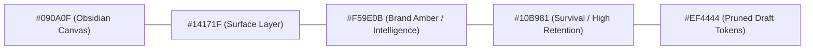

# BRAND & DESIGN SPECIFICATION: Agncy

**Status:** Approved Specification  
**Project:** Agncy (Personal Content Agency Workspace)  
**Target:** Personal Brand Workspace (Sole Creator: Elton)  
**Tagline:** "The in-house content agency for one."  
**Last Updated:** September 29, 2026  

---

## 1. Brand Philosophy & Positioning

### 1.1 The Anti-Generic AI Stance
Most AI content tools generate generic, lukewarm copy because they operate with zero memory. Every prompt starts from zero, forcing you into endless prompt engineering or frustrating line-by-line rewrites. When you finally publish, your performance analytics live in an isolated dashboard completely disconnected from the prompts that produced them.

**Agncy flips the model:**
* **Your edits are training data, not wasted time:** Every time you rewrite a hook or delete a robotic sentence, Agncy measures what survived and learns your voice.
* **Closed-loop intelligence:** Performance metrics from Meta (retention, views, distribution) feed back into the idea generator, making future ideas inherently tailored to what your audience actually rewards.
* **Studio-grade craftsmanship:** Agncy is not a "one-click viral meme generator"; it is a precision cockpit designed solely to elevate your personal content output.

---

## 2. Creator Profile & Brand Identity

### 2.1 The Creator Persona (Elton)

| Attribute | Profile Detail |
|---|---|
| **Creator Name** | Elton |
| **Niche** | Civic innovation, community technology, and grassroots public-interest tech projects. |
| **Content Language** | Conversational Taglish (Natural balance of English concepts and colloquial Filipino sentence structure & particles: *kasi*, *naman*, *ba*, *talaga*). |
| **Tone of Voice** | Direct, grounded, analytical, empathetic. No corporate jargon ("synergy", "paradigm shift"), no sensationalist clickbait. |
| **Primary Formats** | Short-form vertical video (Facebook Reels, TikTok, YouTube Shorts; 30–60 seconds) with visual cues and hardcoded captions. |
| **Core Goal** | High-retention, high-impact civic messaging with minimum friction between ideation and exported video. |

---

## 3. Visual Tone & Design System

Agncy avoids the playful, cartoonish aesthetic of consumer social apps in favor of a **focused, high-density studio aesthetic** inspired by Linear, Raycast, and professional post-production software.

### 3.1 Visual Atmosphere
* **Theme:** Deep obsidian and slate dark mode by default (optimizes focus and prevents eye fatigue during late-night scripting and video editing).
* **Surfaces:** Subtle 1px borders with low-opacity glassmorphism overlays (`backdrop-blur-md`).
* **Visual Hierarchy:** Typography-driven with sharp contrast between active script drafts, teleprompter readouts, and diff annotations.

### 3.2 Color Tokens

| Token Name | Hex Code | Purpose |
|---|---|---|
| **Canvas Background** | `#090A0F` | Deep dark obsidian ground layer |
| **Surface Raised** | `#14171F` | Cards, sidebars, modal panels, editor panes |
| **Surface Subtle** | `#1E222B` | Hover states, secondary buttons, active tab pills |
| **Border Subtle** | `#262B36` | 1px clean separation lines |
| **Border Strong** | `#3B4252` | Focused inputs, selected cards, active diff segments |
| **Accent Primary** | `#F59E0B` (Amber 500) | Brand intelligence, primary actions, focus rings |
| **Metric Success** | `#10B981` (Emerald 500) | Retained tokens, high retention watch times, approved rules |
| **Metric Diff Pruned**| `#EF4444` (Rose 500) | Pruned AI tokens in script diff comparison |
| **Text Primary** | `#F8FAFC` (Slate 50) | High readability script text and headlines |
| **Text Secondary** | `#CBD5E1` (Slate 300) | Body copy, spoken cue text |
| **Text Muted** | `#94A3B8` (Slate 400) | Timestamps, secondary labels, visual directions |

---

### 3.3 Typography Architecture

Agncy pairs a clean geometric sans-serif for UI navigation with a monospaced typeface for scripts and teleprompter readouts.

| Role | Font Family | Usage & Rationale |
|---|---|---|
| **UI & Headings** | **Geist Sans** or **Inter** | Ultra-clean, modern geometric sans with high legibility across dense dashboard metrics and table data. |
| **Script Studio & Diff View** | **Geist Mono** or **JetBrains Mono** | Monospace gives scripts a physical cue-sheet structure. Word-by-word timing and character counts are immediately predictable. |
| **Subtitle Burn-in Preset** | **THE BOLD FONT** / **Montserrat Black** | High-impact, heavy weight typography optimized for mobile 9:16 vertical short-form readability. |

---

## 4. Editorial Voice & Copy Guidelines

Every piece of copy inside the application (microcopy, empty states, system feedback) adheres to these guidelines:

| Attribute | What Agncy Sounds Like | What Agncy Avoids |
|---|---|---|
| **Pragmatic** | *"Imported 19 posts. Linked 3 reels to scripts."* | *"Boom! Your content just got supercharged with magic AI!"* |
| **Honest** | *"Survival rate dropped 14%. Your hook was completely rewritten."* | *"Amazing job! Your script is ready to go viral!"* |
| **Analytical** | *"Reels with question hooks generated 11.2s average watch time."* | *"The algorithm loved your latest video!"* |
| **Empowering** | *"You control the rules. Review 2 suggested style constraints."* | *"AI will now automatically write everything for you without checking."* |
