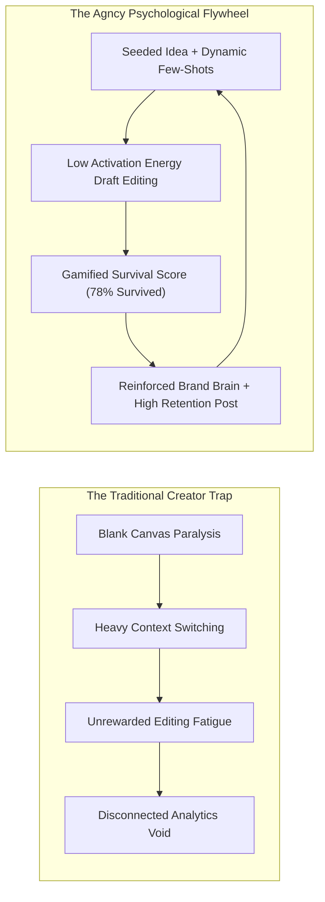
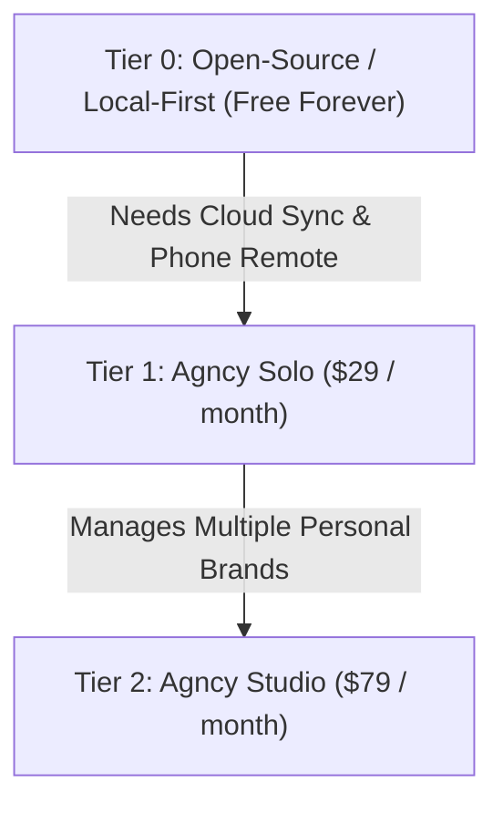
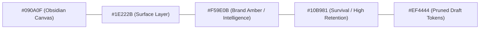

# BRAND & MARKETING STRATEGY: Agncy

**Status:** Approved Specification  
**Project:** Agncy (Personal Content Agency Workspace)  
**Tagline:** "The in-house content agency for one."  
**Last Updated:** September 29, 2026  

---

## 1. Brand Philosophy & Core Positioning

### 1.1 The Anti-Generic AI Stance
Most AI content tools generate generic, lukewarm copy because they operate with zero memory. Every prompt starts from zero, forcing creators into endless prompt engineering or frustrating line-by-line rewrites. When creators finally publish, their performance analytics live in an isolated dashboard completely disconnected from the prompts that produced them.

**Agncy flips the model:**
* **Your edits are training data, not wasted time:** Every time you rewrite a hook or delete a robotic sentence, Agncy measures what survived and learns your voice.
* **Closed-loop intelligence:** Performance metrics from Meta (retention, views, distribution) feed back into the idea generator, making future ideas inherently tailored to what your audience actually rewards.
* **Studio-grade craftsmanship:** Agncy is not a "one-click viral meme generator"; it is a precision cockpit for serious solo creators who treat content as an asset.

---

## 2. Target Personas & Audience Profiling

### 2.1 Persona 1: "The Solo Civic Builder" (Creator Zero / Current User)

| Attribute | Profile Detail |
|---|---|
| **Identity** | Solo creator producing civic, community, and tech empowerment content in mixed Filipino/English (Taglish). |
| **Current Workflow** | Writes scripts in Notes or Google Docs, films on phone, edits in CapCut, manually uploads to Meta Business Suite, checks stats once a week. |
| **Core Frustrations** | Context switching between 5 apps; generic AI doesn't understand Taglish conversational rhythm; no clue which specific hooks caused a 15k view spike vs a 2k view dud. |
| **Emotional Goal** | Consistent output without burnout; maintaining genuine voice and community trust without sounding like an AI bot. |
| **Success State** | Cutting time from idea to finalized video by 50% while watching AI draft survival climb above 75%. |

---

### 2.2 Persona 2: "The Boutique Solopreneur" (Commercial Target / Post-Validation)

| Attribute | Profile Detail |
|---|---|
| **Identity** | Independent consultants, technical founders, and niche educators building authority on LinkedIn, Reels, and YouTube Shorts. |
| **Current Workflow** | Spends 6–10 hours/week on content or pays a $1,500/month junior ghostwriter whose drafts still need heavy re-editing. |
| **Core Frustrations** | Ghostwriters lack technical depth; off-the-shelf AI sounds corporate and hollow; content creation distracts from client delivery. |
| **Willingness to Pay** | High ($29 to $79/month) if it replaces a part-time assistant and guarantees voice consistency. |

---

## 3. Behavioral Economics & Psychological Drivers

### 3.1 Activation Energy: Editing vs. Originating
Behavioral psychology demonstrates that the cognitive barrier to **editing an existing draft** is 70% lower than **staring at a blank page**. Agncy ensures the creator never faces a blank canvas, delivering a structured hook, beats, and visual cues instantly.

### 3.2 Sunk-Cost Transformation & The Gamified Survival Metric
In typical workflows, having to heavily rewrite an AI draft triggers annoyance ("Why did I even bother using AI?"). Agncy introduces the **Draft Survival Rate**:
* When a creator edits a script, Agncy displays: `Survival Rate: 68% -> +12% from last week`.
* Edits are no longer wasted effort—they are active training signals that build the creator's proprietary Brand Brain.

### 3.3 Closing the Analytics Feedback Void
Most creators feel a sense of randomness in the algorithm. By linking Meta post snapshots directly to the underlying script hook, Agncy gives creators immediate causal clarity:
> *"Reels with question-based Taglish hooks average 11.2s watch time, compared to 3.2s for statement hooks."*

---

## 4. Willingness to Pay & Monetization Strategy

*(For commercialization post-validation)*

| Tier | Price | Ideal For | Features & Inclusions |
|---|---|---|---|
| **Local Community** | **$0** (Local Build) | Solo hobbyists & developers | 100% local-first, bring your own Gemini API key, local Whisper & SQLite, single brand. |
| **Agncy Pro** | **$29 / mo** | Professional Solopreneurs | Hosted cloud backend, mobile sync, automated social scheduling, automatic daily Meta API insights sync. |
| **Agncy Studio** | **$79 / mo** | Boutique Agencies & Managers | Up to 5 separate Brand Brains, multi-creator workspaces, team approval workflows, client reporting exports. |

---

## 5. Visual Tone, Aesthetics & Design System

Agncy avoids the playful, cartoonish aesthetic of consumer apps in favor of a **focused, high-density studio aesthetic** inspired by Linear, Raycast, and professional video editing software (DaVinci Resolve).

### 5.1 Visual Atmosphere
* **Theme:** Deep obsidian and slate dark mode by default (reduces eye strain during long scripting and video editing sessions).
* **Surfaces:** Subtle 1px borders with low-opacity glassmorphism overlays (`backdrop-blur-md`).
* **Visual Hierarchy:** Typography-driven with sharp contrast between active script drafts and diff annotations.

### 5.2 Color Tokens

| Token Name | Hex Code | Purpose |
|---|---|---|
| **Canvas Background** | `#090A0F` | Deep dark obsidian ground layer |
| **Surface Raised** | `#14171F` | Cards, sidebars, drawer panels |
| **Border Subtle** | `#262B36` | 1px clean separation lines |
| **Accent Primary** | `#F59E0B` (Amber 500) | Brand intelligence, active buttons, focus rings |
| **Metric Success** | `#10B981` (Emerald 500) | Retained tokens, high retention stats, approved rules |
| **Metric Diff Pruned**| `#EF4444` (Rose 500) | Pruned AI tokens in diff view |
| **Text Primary** | `#F8FAFC` (Slate 50) | High readability script text and headlines |
| **Text Muted** | `#94A3B8` (Slate 400) | Timestamps, secondary labels, visual notes |

---

### 5.3 Typography Architecture

Agncy pairs a clean, geometric sans-serif for navigation with a monospaced typeface for scripts and teleprompter readouts.

| Role | Font Family | Usage & Rationale |
|---|---|---|
| **UI & Headings** | **Geist Sans** or **Inter** | Ultra-clean, modern geometric sans with high legibility across dense dashboard data. |
| **Script Studio & Diff View** | **Geist Mono** or **JetBrains Mono** | Monospace gives scripts a physical cue-sheet structure. Word-by-word timing and character counts are immediately predictable. |
| **Subtitle Burn-in Preset** | **THE BOLD FONT** / **Montserrat Black** | High-impact, heavy weight typography optimized for mobile 9:16 vertical short-form readability. |

---

## 6. Tone of Voice & Copy Guidelines

| Attribute | What Agncy Sounds Like | What Agncy Avoids |
|---|---|---|
| **Pragmatic** | *"Imported 19 posts. Linked 3 reels to scripts."* | *"Boom! Your content just got supercharged with magic AI!"* |
| **Honest** | *"Survival rate dropped 14%. Your hook was completely rewritten."* | *"Amazing job! Your script is ready to go viral!"* |
| **Analytical** | *"Reels with question hooks generated 11.2s average watch time."* | *"The algorithm loved your latest video!"* |
| **Empowering** | *"You control the rules. Review 2 suggested style constraints."* | *"AI will now automatically write everything for you without checking."* |
