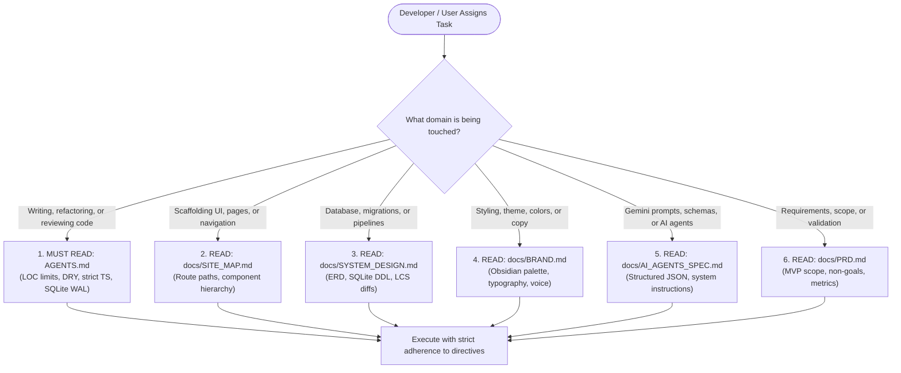

# REPOSITORY CONTEXT & AI NAVIGATION INDEX: Agncy

**Target Audience:** AI Coding Agents (Antigravity, Cursor, Claude Code), Subagents, and Developers  
**Project:** Agncy (Personal Content Agency Workspace)  
**Last Updated:** September 29, 2026  

---

## 1. AI Navigation Directives

As an AI coding assistant working on **Agncy**, you operate in a specialized, local-first studio application. Do **not** guess architectural patterns, API schemas, design tokens, or file boundaries. 

The repository's documentation is divided into single-responsibility context files inside `/docs` and `/AGENTS.md`. **Always consult the specific documentation file before modifying or creating code in that domain.**

---

## 2. Master Documentation Registry

| File Path | Core Purpose | When an AI Agent MUST Read It |
|---|---|---|
| [`AGENTS.md`](file:///Users/eltonjames/Desktop/Personal%20Apps/Agncy/AGENTS.md) | **Engineering Standards & Coding Directives** Defines hard file size limits (max 250–300 LOC), DRY rules, strict TypeScript rules (zero `any`), SQLite WAL conventions, and safe subprocess handling. | **Before writing or editing ANY code** in this codebase. Non-negotiable baseline. |
| [`docs/PRD.md`](file:///Users/eltonjames/Desktop/Personal%20Apps/Agncy/docs/PRD.md) | **Product Requirements & Scope Boundaries** Defines the core problem, user stories, acceptance criteria, MVP non-goals, and success metrics (e.g. draft survival targets). | When clarifying feature scope, understanding user intent, verifying acceptance criteria, or validating what is in/out of v1. |
| [`docs/SYSTEM_DESIGN.md`](file:///Users/eltonjames/Desktop/Personal%20Apps/Agncy/docs/SYSTEM_DESIGN.md) | **System Architecture & Technical Specifications** Contains the full Mermaid ERD, SQLite DDL schemas, CSV normalization engine, token LCS diff calculation, and hardware-accelerated media pipelines. | When creating or migrating database tables, building API routes / Server Actions, or writing data processing logic. |
| [`docs/SITE_MAP.md`](file:///Users/eltonjames/Desktop/Personal%20Apps/Agncy/docs/SITE_MAP.md) | **Architectural Routing & Component Hierarchies** Maps every Next.js App Router route (`/`, `/scripts`, `/brand`, `/studio`, `/analytics`, `/calendar`), component trees, state variants (empty/loading/active), and keyboard shortcuts. | When scaffolding new routes, creating UI layouts, adding interactive modals/drawers, or connecting cross-module navigation. |
| [`docs/BRAND.md`](file:///Users/eltonjames/Desktop/Personal%20Apps/Agncy/docs/BRAND.md) | **Personal Brand & Design System Tokens** Defines Elton's brand persona (civic tech in conversational Taglish), dark obsidian studio aesthetic (`#090A0F`), exact Tailwind hex colors, typography pairings (Geist & JetBrains Mono), and editorial voice. | When styling components, choosing color classes, setting up typography, writing microcopy, or tuning prompt tone. |
| [`docs/AI_AGENTS_SPEC.md`](file:///Users/eltonjames/Desktop/Personal%20Apps/Agncy/docs/AI_AGENTS_SPEC.md) | **Google Gemini Agent Fleet Specifications** Directives, system instructions, Zod/JSON schemas, and `@google/genai` tool definitions for all 6 autonomous agents (`ScriptWriter`, `DiffAnalysis`, `StyleSynthesizer`, `IdeaResearch`, `PostMatcher`, `TranscriptOptimizer`). | When creating or editing AI workflows, assembling LLM prompt contexts, or parsing structured JSON outputs from Gemini. |

---

## 3. Task-to-Context Decision Matrix

Use this matrix to immediately identify which files to load into context for common development tasks:

### 3.1 Scenario: Implementing Database Schemas & Migrations
1. Read [`AGENTS.md`](file:///Users/eltonjames/Desktop/Personal%20Apps/Agncy/AGENTS.md) (Section 4: SQLite conventions, WAL mode, transaction wrapping).
2. Read [`docs/SYSTEM_DESIGN.md`](file:///Users/eltonjames/Desktop/Personal%20Apps/Agncy/docs/SYSTEM_DESIGN.md) (Section 2: Complete ERD and DDL table definitions).
3. Do **not** write queries with raw SQL string concatenation.

### 3.2 Scenario: Building a New UI View or Layout
1. Read [`AGENTS.md`](file:///Users/eltonjames/Desktop/Personal%20Apps/Agncy/AGENTS.md) (Section 2: LOC limits & decomposition protocol; Section 6: RSC by default).
2. Read [`docs/SITE_MAP.md`](file:///Users/eltonjames/Desktop/Personal%20Apps/Agncy/docs/SITE_MAP.md) (Component hierarchy, route paths, state variants).
3. Read [`docs/BRAND.md`](file:///Users/eltonjames/Desktop/Personal%20Apps/Agncy/docs/BRAND.md) (Color tokens: `#090A0F`, `#14171F`, `#F59E0B`; font pairings: Geist Sans & Geist Mono).

### 3.3 Scenario: Implementing or Modifying a Gemini AI Feature
1. Read [`AGENTS.md`](file:///Users/eltonjames/Desktop/Personal%20Apps/Agncy/AGENTS.md) (Section 7: `@google/genai` SDK standard, Pro vs Flash model division).
2. Read [`docs/AI_AGENTS_SPEC.md`](file:///Users/eltonjames/Desktop/Personal%20Apps/Agncy/docs/AI_AGENTS_SPEC.md) (Find the specific agent's prompt, input payload, and JSON schema).
3. Read [`docs/BRAND.md`](file:///Users/eltonjames/Desktop/Personal%20Apps/Agncy/docs/BRAND.md) (Ensure prompts enforce conversational Taglish and Elton's civic persona).

### 3.4 Scenario: Building Video / Audio Processing (Captions, Whisper, FFmpeg)
1. Read [`AGENTS.md`](file:///Users/eltonjames/Desktop/Personal%20Apps/Agncy/AGENTS.md) (Section 5: Subprocess safety, non-blocking spawns, Apple VideoToolbox).
2. Read [`docs/SYSTEM_DESIGN.md`](file:///Users/eltonjames/Desktop/Personal%20Apps/Agncy/docs/SYSTEM_DESIGN.md) (Section 3.3: Journey C sequence diagram; Section 5: Whisper Taglish hallucination mitigations).

### 3.5 Scenario: Ingesting Meta Analytics CSV Files
1. Read [`docs/SYSTEM_DESIGN.md`](file:///Users/eltonjames/Desktop/Personal%20Apps/Agncy/docs/SYSTEM_DESIGN.md) (Section 4.1: UTF-8 BOM stripping, Unicode bold mathematical character normalization).
2. Read [`docs/PRD.md`](file:///Users/eltonjames/Desktop/Personal%20Apps/Agncy/docs/PRD.md) (Section 7.6: Known CSV format, column definitions, lifetime-to-date snapshotting).

---

## 4. Pre-Commit Verification Sequence

Whenever completing a task, the AI agent must run the pre-commit checklist outlined in [`AGENTS.md`](file:///Users/eltonjames/Desktop/Personal%20Apps/Agncy/AGENTS.md#8-agent-pre-commit--verification-checklist):
1. **LOC Check:** Are all new/edited files under **300 LOC**?
2. **Type Check:** Does `tsc --noEmit` pass with zero errors?
3. **DRY Check:** Is duplicated data transformation or utility logic extracted to `lib/`?
4. **Token Check:** Are colors using the exact hex tokens from [`docs/BRAND.md`](file:///Users/eltonjames/Desktop/Personal%20Apps/Agncy/docs/BRAND.md)?
