# SITE MAP & NAVIGATION ARCHITECTURE: Agncy

**Status:** Approved Specification  
**Project:** Agncy (Personal Content Agency Workspace)  
**Framework:** Next.js 15+ (App Router)  
**Target Viewports:** Desktop (Primary Studio Experience, min 1280px) & Mobile Web (Responsive Viewer, min 375px)  
**Last Updated:** September 29, 2026  

---

## 1. Information Architecture Overview

Agncy is organized into five core functional hubs centered around the persistent **Brand Brain**. The navigation model emphasizes rapid cross-module transitions (e.g. converting an approved Idea into a Script, or linking an imported Post to a finalized Script) with persistent state and instant local database access.

```mermaid
graph TD
    AppShell["Root Layout (App Shell & Global Sidebar)"]
    
    Dashboard["/ (Dashboard)"]
    BrandBrain["/brand (Brand Brain)"]
    ScriptStudio["/scripts (Script Studio)"]
    IdeasHub["/ideas (Idea Generator)"]
    MediaStudio["/studio (Captions & Media Studio)"]
    Analytics["/analytics (Analytics & Meta Importer)"]
    Calendar["/calendar (Content Calendar)"]

    AppShell --> Dashboard
    AppShell --> BrandBrain
    AppShell --> ScriptStudio
    AppShell --> IdeasHub
    AppShell --> MediaStudio
    AppShell --> Analytics
    AppShell --> Calendar

    %% Sub-routes
    BrandBrain --> BrandProfile["/brand/profile (Identity & Tone)"]
    BrandBrain --> StyleRules["/brand/rules (Learned Style Rules)"]
    BrandBrain --> FewShots["/brand/examples (Top Script Pairs)"]

    ScriptStudio --> ScriptList["/scripts (Archive & Backlog)"]
    ScriptStudio --> ScriptEditor["/scripts/[id] (Interactive Editor & Diff)"]
    ScriptStudio --> ScriptNew["/scripts/new (Draft Creation)"]

    IdeasHub --> IdeaDeck["/ideas (Trending & Backlog)"]
    IdeasHub --> IdeaResearch["/ideas/research (Niche Scan & Trends)"]

    MediaStudio --> TranscribeView["/studio/transcribe (Whisper Audio/Video)"]
    MediaStudio --> SubtitleEditor["/studio/[assetId]/subtitles (Timing & Style)"]
    MediaStudio --> RenderQueue["/studio/render (Video Export & Progress)"]

    Analytics --> PostsTable["/analytics (Lifetime Posts & Stats)"]
    Analytics --> ImportModal["/analytics/import (CSV Drag-and-Drop)"]
    Analytics --> PostDetail["/analytics/posts/[id] (Snapshots & Velocity)"]
```



---

## 2. Screen-by-Screen Routing & Hierarchy

### 2.1 Global App Shell & Shell Components

* **Layout Route:** `app/(workspace)/layout.tsx`
* **Persistent Components:**
  * `SidebarNavigation`: Persistent left rail (collapsed on `< 768px`, expandable drawer on mobile).
    * Brand Logo (`Agncy` badge with local connection status indicator).
    * Primary Hub Links: Dashboard, Scripts, Ideas, Studio, Analytics, Calendar.
    * Brand Brain Quick Glance: Active persona chips, active style rule count.
    * Local Hardware Indicator: Whisper engine readiness (Metal/CPU) & SQLite WAL status.
  * `GlobalCommandPalette` (`Cmd + K`):
    * Quick jump to any script, idea, or post by title.
    * Trigger instant actions: "New Script", "Import Meta CSV", "Transcribe Video".
  * `NotificationToaster`: Non-intrusive feedback for background processes (e.g. "Whisper transcription finished (3.4s)", "Meta CSV imported (19 rows)").

---

### 2.2 Dashboard (`/`)

* **Purpose:** High-level command center showing recent content velocity, script learning efficiency, and quick actions.
* **Component Tree:**
  ```
  Page: app/(workspace)/page.tsx
  ├── MetricSummaryCards
  │   ├── Card: Average Draft Survival Rate (30-day trend line)
  │   ├── Card: Content Velocity (Posts this month vs. previous month)
  │   ├── Card: Top Performing Hook (From linked Meta Reel)
  │   └── Card: Pending Style Rules (Badge with count awaiting review)
  ├── ActiveWorkspaceGrid
  │   ├── QuickDraftWidget (Input topic -> click 'Generate Draft')
  │   ├── RecentScriptsCarousel (Last 5 active scripts with survival %)
  │   └── HighVelocityPostsList (Top Reels sorted by avg watch time)
  └── StyleHealthBanner (Alerts when >= 5 new script diffs are ready for synthesis)
  ```
* **State Variants:**
  * *Zero State:* Prompts user to (1) Set up Brand Profile and (2) Import initial Meta CSV.
  * *Active State:* Populated charts, real-time diff survival averages, and fast action links.

---

### 2.3 Brand Brain Hub (`/brand/*`)

* **Purpose:** Central intelligence store read by Google Gemini agents during generation and updated by the style engine.

#### Screen 2.3.1: Brand Profile (`/brand/profile`)
* **Route:** `app/(workspace)/brand/profile/page.tsx`
* **Components:**
  * `IdentityForm`: Creator name, niche keywords, primary audience demographics.
  * `ToneMatrixEditor`: Tone adjectives (e.g., "Sharp", "Direct", "Civic-minded", "Grounded"), language mix selector (`Taglish`, `Filipino`, `English`).
  * `DosAndDontsList`: Tag-based list of strictly prohibited words, mandatory phrases, and topical boundaries.
  * `SaveStatusBadge`: Real-time optimistic update badge ("Saved to SQLite").

#### Screen 2.3.2: Learned Style Rules (`/brand/rules`)
* **Route:** `app/(workspace)/brand/rules/page.tsx`
* **Components:**
  * `StyleRulesFilterBar`: Filter by category (`Hook`, `Pacing`, `Vocabulary`, `Structure`, `Tone`) and status (`Proposed`, `Active`, `Rejected`, `Archived`).
  * `RuleProposalSection` (Highlighted when status = `proposed`):
    * Card showing rule text (e.g. *"Eliminate introductory greetings; start directly with the paradox"*).
    * `RationaleAccordion`: AI explanation of which script edits triggered this rule.
    * Action buttons: `Approve`, `Edit & Save`, `Discard`.
  * `ActiveRulesTable`: Reorderable, toggleable list of rules currently injected into Gemini prompts.

#### Screen 2.3.3: Few-Shot Examples Library (`/brand/examples`)
* **Route:** `app/(workspace)/brand/examples/page.tsx`
* **Components:**
  * `PairViewer`: Side-by-side card showing initial AI draft vs. user final script with the linked Reel performance stats (views, watch time).
  * Toggle: `Include in Prompt Few-Shots` (Max 3 active pairs dynamically injected into Gemini context).

---

### 2.4 Script Studio (`/scripts/*`)

* **Purpose:** The core product bet—where AI drafts scripts, users edit them, and Agncy measures the quantitative survival rate.

#### Screen 2.4.1: Script Index & Backlog (`/scripts`)
* **Route:** `app/(workspace)/scripts/page.tsx`
* **Components:**
  * `ScriptFilterTabs`: `All`, `Drafting`, `Finalized`, `Filmed`, `Published`.
  * `ScriptDataTable`:
    * Columns: Title, Format (Reel/Short/Post), Target Duration, Survival %, Linked Post, Updated Date.
  * Action: Primary button `+ New Script`.

#### Screen 2.4.2: Script Editor & Diff Studio (`/scripts/[id]`)
* **Route:** `app/(workspace)/scripts/[id]/page.tsx`
* **Components:**
  * `EditorHeader`:
    * Title inline edit, format badge (`Reel 45s`), status dropdown.
    * Primary CTA: `Save Final Version` | Secondary CTA: `Re-generate Section`.
    * Linked Post Badge (Click to open linking modal).
  * `SplitStudioLayout` (Collapsible into single editor on smaller screens):
    * **Left Pane (`AI Draft Pane`):** Shows original AI-generated text with color-coded token survival highlights (green = retained in final, red strikethrough = deleted by user).
    * **Right Pane (`Interactive Editor`):** Full WYSIWYG / Markdown editor for typing the creator's final version.
  * `SurvivalMetricFooter`:
    * Live meter: `Draft Survival: 78%` (Retained tokens vs. Draft tokens).
    * Token count, estimated speaking duration (based on 140 words/min pacing).
  * `DiffExplanationDrawer` (Slide-out drawer):
    * Shows breakdown of what was altered: "Hook shortened by 42%", "Taglish slang substituted in body", "CTA reformatted to question".

---

### 2.5 Content Idea Generator (`/ideas/*`)

* **Purpose:** Autonomous trend discovery matching the creator's niche with proven top-performing structures.

* **Route:** `app/(workspace)/ideas/page.tsx`
* **Components:**
  * `IdeaSearchBar`: Search input with `Scan Trends with Gemini` button (uses Google Search Grounding).
  * `IdeaKanban / CardDeck`:
    * Columns: `Suggested`, `Saved / Backlog`, `Converted to Script`, `Dismissed`.
  * `IdeaCard`:
    * Topic headline and proposed hook angle.
    * `FitRationaleChip`: Explains why it fits (e.g. *"Matches your top Reel: 15.8k views community hook"*).
    * Predicted Performance Fit Badge (High / Medium).
    * Action button: `Send to Script Writer` (Creates script draft with 1-click and redirects to `/scripts/[newId]`).

---

### 2.6 Local Captions & Media Studio (`/studio/*`)

* **Purpose:** High-speed, local video processing using `whisper.cpp` / `mlx-whisper` and Apple VideoToolbox.

#### Screen 2.6.1: Video Upload & Transcription (`/studio`)
* **Route:** `app/(workspace)/studio/page.tsx`
* **Components:**
  * `LocalFileDropzone`: Drag-and-drop `.mp4` / `.mov` files directly from disk.
  * `WhisperConfigCard`: Language selector (`Auto`, `Taglish (Filipino/English)`, `English`), Model picker (`Tiny`, `Base`, `Medium`).
  * `TranscriptionProgressBanner`: Live timer showing processing speed and Metal GPU utilization.

#### Screen 2.6.2: Subtitle Timing & Style Editor (`/studio/[assetId]/subtitles`)
* **Route:** `app/(workspace)/studio/[assetId]/page.tsx`
* **Components:**
  * `VideoPreviewPlayer`: HTML5 video player with real-time overlay captions.
  * `InteractiveTranscriptList`:
    * Word-level timestamp blocks (`[00:01.200 - 00:03.400]`).
    * Inline text editing for quick Taglish typo corrections.
  * `CaptionStylePresetSelector`:
    * Presets: `Classic Reel (Bold Yellow)`, `Minimal Modern (White with Outline)`, `High Impact (1-Word Bounce Animation)`.
    * Controls: Font size, line spacing, vertical margin offset.
  * `ExportBar`:
    * Button `Export .SRT Subtitles`.
    * Primary Button `Render Burned Video (VideoToolbox Hardware)`.
    * Progress Modal with real-time rendering percentage.

---

### 2.7 Analytics Hub & Meta CSV Importer (`/analytics/*`)

* **Purpose:** Ingest Meta Business Suite CSV exports, snapshot lifetime performance, and establish the feedback loop to scripts.

* **Route:** `app/(workspace)/analytics/page.tsx`
* **Components:**
  * `ImporterModal` (`/analytics/import`):
    * Drag-and-drop zone accepting `*.csv` files.
    * Pre-import validator: verifies BOM header, checks for Meta column signatures.
    * Batch summary results: `[N rows added, N rows updated, N errors]`.
  * `AnalyticsSummaryCards`:
    * Total Views, Top Post Views, Average Reel Watch Time, Script Linkage Rate (% of posts linked to scripts).
  * `PostsDataTable`:
    * Sortable columns: Thumbnail/Type, Cleaned Title (Unicode normalized), Published Date, Views, Viewers, Avg Watch Time, Interactions, Distribution.
    * `ScriptLinkColumn`: Dropdown showing linked script or fuzzy matching recommendation badge (`Match: "Building in Public" (94% confidence)`).
  * `PostDetailDrawer` (`/analytics/posts/[id]`):
    * Side-panel showing snapshot history across different import batches (plots view growth over time).

---

### 2.8 Content Calendar (`/calendar`)

* **Purpose:** Visual timeline planner for scheduling releases and logging post-mortem results manually.

* **Route:** `app/(workspace)/calendar/page.tsx`
* **Components:**
  * `CalendarGrid`: Month / Week view.
  * `CalendarDayCell`: Shows scheduled scripts and published post badges.
  * `UnscheduledDrawer`: Draggable sidebar containing finalized scripts awaiting release dates.

---

## 3. Global Navigation Matrix & Cross-Module User Flows

| Starting Screen | Trigger / Action | Destination Screen | Data Transferred |
|---|---|---|---|
| **Dashboard** | Click "Quick Draft" | `/scripts/[newId]` | Pre-populated topic, redirects to active editor. |
| **Ideas Hub** | Click "Send to Script Writer" | `/scripts/[newId]` | Pre-populates title, hook angle, and reference idea ID. |
| **Script Studio** | Click "Send to Subtitle Studio" | `/studio` | Pre-links script ID to upcoming video transcript. |
| **Analytics** | Click "Link Script" suggestion | `/analytics` | Updates `posts.script_id` via optimistic local mutation. |
| **Analytics** | Click Linked Script Badge | `/scripts/[id]` | Navigates directly to script editor & diff history. |
| **Brand Brain** | Click "Approve Style Rule" | `/brand/rules` | Updates rule status to `active`; auto-injected into next Gemini run. |

---

## 4. Keyboard Navigation & Studio Shortcuts

To ensure high productivity for daily content creation, Agncy implements global and context-aware keyboard shortcuts:

| Shortcut | Scope | Action |
|---|---|---|
| `Cmd + K` | Global | Open Command Palette / Fast Search |
| `Cmd + S` | Script Editor | Save Script & Compute LCS Survival Metric |
| `Cmd + Enter` | Script Editor | Trigger AI Revision / Regenerate Section |
| `Space` | Subtitle Studio | Play / Pause Video Preview |
| `Cmd + Left / Right` | Subtitle Studio | Jump to Previous / Next Subtitle Block |
| `Tab` | Subtitle Studio | Move cursor to next word timestamp |
| `Cmd + I` | Analytics | Open CSV Import Modal |
| `Esc` | Modals / Drawers | Close active overlay and return focus to main view |
