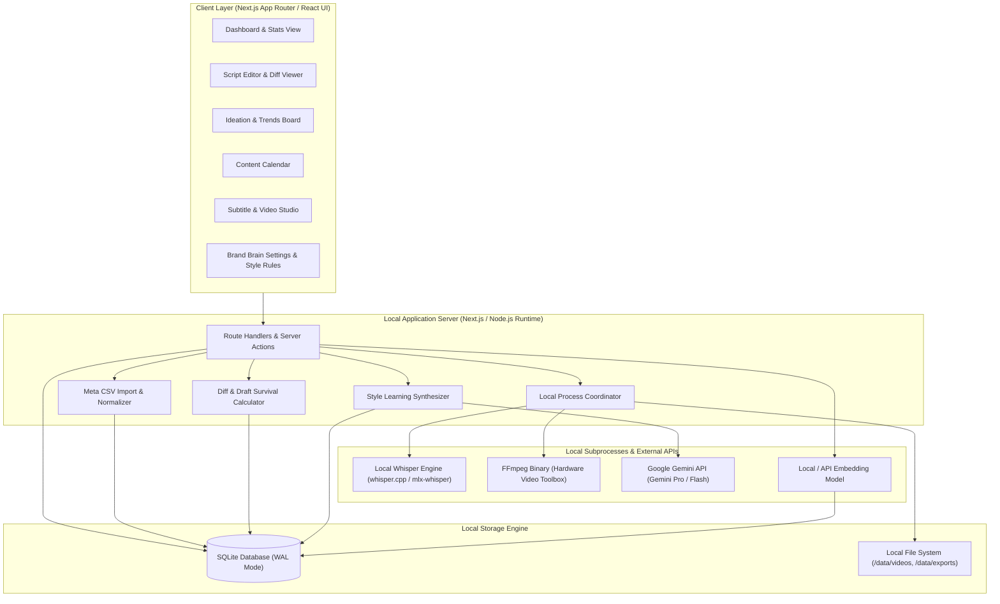
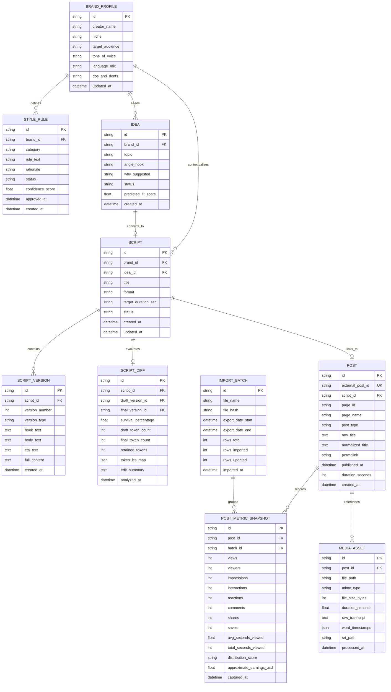
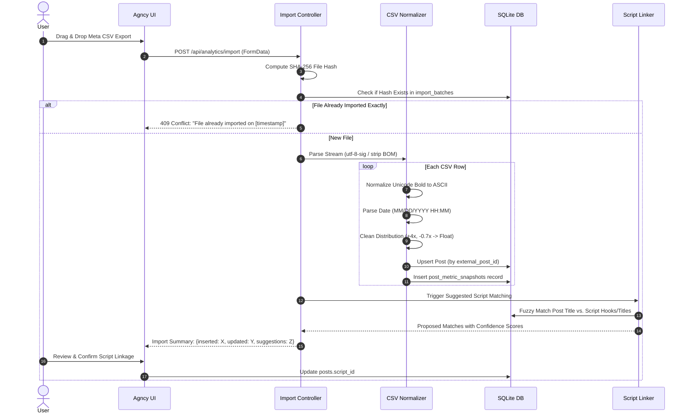
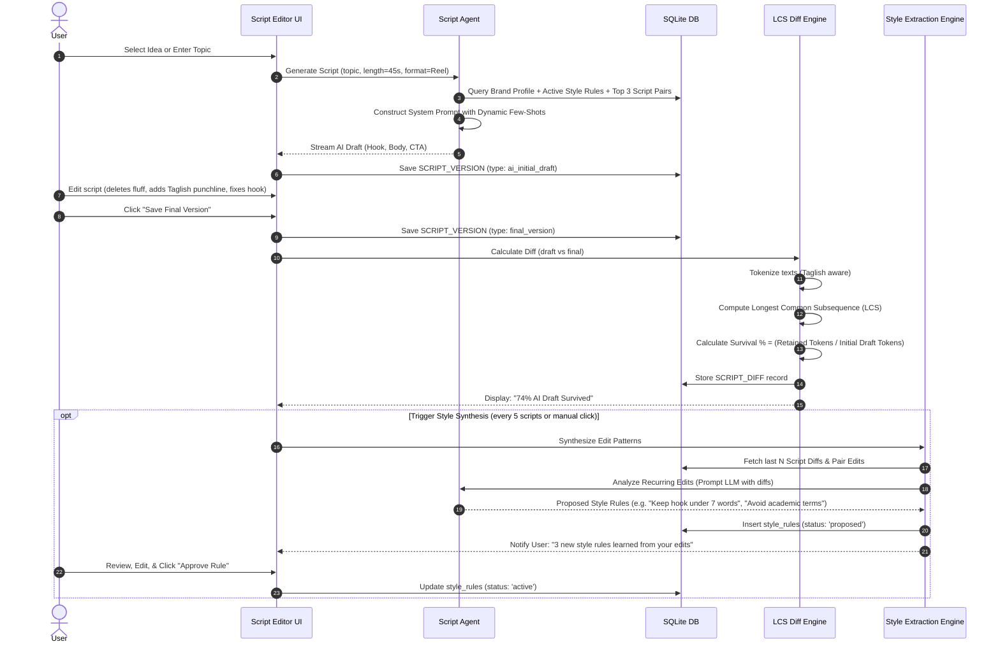
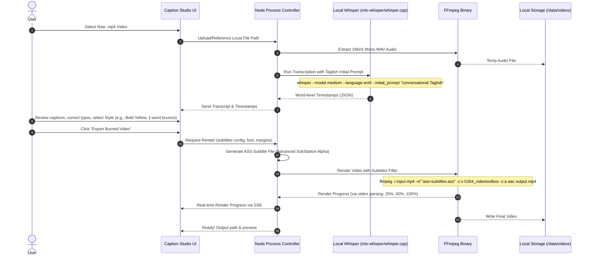
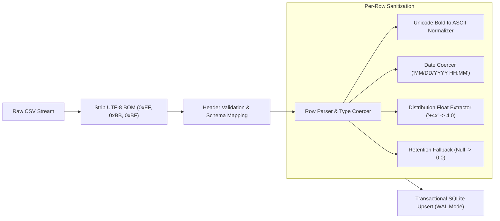
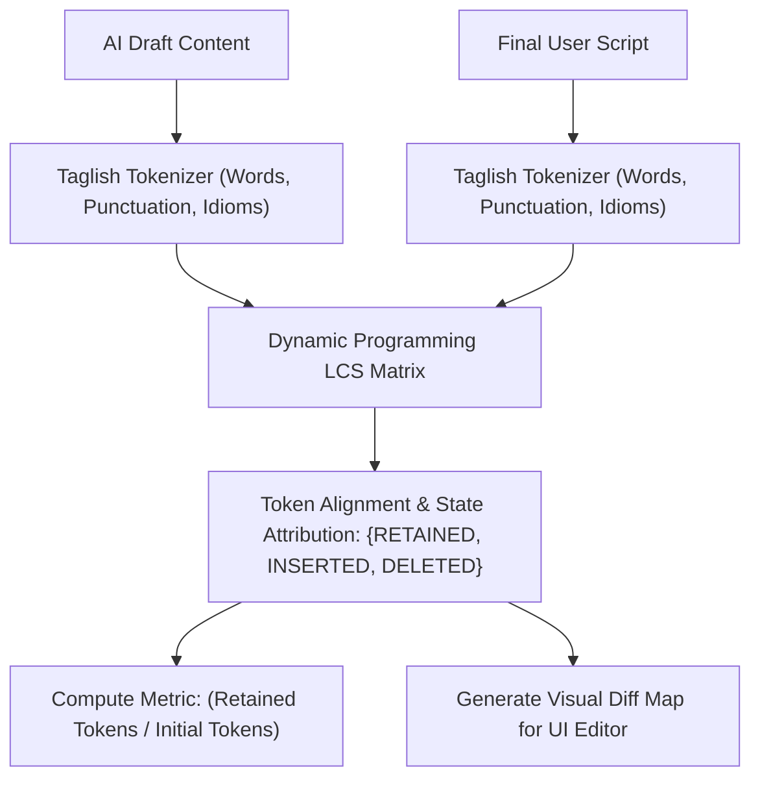
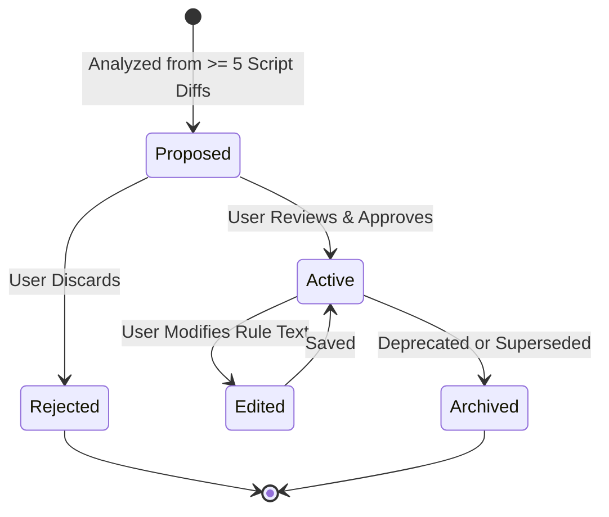

# SYSTEM DESIGN: Agncy

**Status:** Approved Architecture Draft  
**Project:** Agncy (Personal Content Agency Workspace)  
**Target:** Local-First Proof of Concept (macOS / Local Web)  
**Last Updated:** September 29, 2026  

---

## 1. Executive Architecture Overview

Agncy is architected as an offline-capable, local-first web application designed for a single creator. The system treats all intelligence (scripting, ideation, captioning) as consumers and contributors of a persistent **Brand Brain**.

### 1.1 High-Level Architecture



### 1.2 Technology Stack

| Layer | Selected Tech | Rationale |
|---|---|---|
| **Frontend & Backend** | Next.js 15+ (App Router), React 19, Tailwind CSS, shadcn/ui | Unified full-stack local server; fast React Server Components; zero remote hosting requirements. |
| **Local Database** | SQLite 3 via `better-sqlite3` or Drizzle ORM | Zero-latency embedded database; single-file storage with WAL mode for fast concurrent reads/writes. |
| **Vector Search** | `sqlite-vec` or in-memory cosine distance over Float32 BLOBs | Embeddings of past scripts and high-performing posts without heavy external vector DB infrastructure. |
| **AI Inference** | Google Gemini (Gemini 2.5 Pro & Flash via `@google/genai`) | State-of-the-art reasoning, huge 2M token context, high-speed drafting, and generous developer quota. |
| **Transcription** | `whisper.cpp` or `mlx-whisper` (macOS Apple Silicon) | Zero cloud latency/cost; Metal hardware acceleration; offline privacy for raw videos. |
| **Media Processing** | FFmpeg with Apple `videotoolbox` acceleration | High-speed silence detection, aspect ratio cropping, and hardcoded ASS/SRT caption burning. |

---

## 2. Entity-Relationship Data Model (ERD)

The database schema manages the entire feedback loop: brand guidelines, posts, snapshots over time, script iterations, draft diffs, and style rules.



### 2.1 Key Database Schemas & Field Definitions

```sql
-- Brand Profile: Singleton record storing active brand identity
CREATE TABLE brand_profiles (
    id TEXT PRIMARY KEY,
    creator_name TEXT NOT NULL,
    niche TEXT NOT NULL,
    target_audience TEXT NOT NULL,
    tone_of_voice TEXT NOT NULL,
    language_mix TEXT NOT NULL DEFAULT 'Taglish (Filipino/English)',
    dos_and_donts TEXT,
    updated_at DATETIME DEFAULT CURRENT_TIMESTAMP
);

-- Style Rules: Extracted from edits, approved by user
CREATE TABLE style_rules (
    id TEXT PRIMARY KEY,
    brand_id TEXT NOT NULL REFERENCES brand_profiles(id) ON DELETE CASCADE,
    category TEXT CHECK(category IN ('hook', 'pacing', 'vocabulary', 'structure', 'tone')),
    rule_text TEXT NOT NULL,
    rationale TEXT,
    status TEXT CHECK(status IN ('proposed', 'active', 'rejected', 'archived')) DEFAULT 'proposed',
    confidence_score REAL DEFAULT 1.0,
    created_at DATETIME DEFAULT CURRENT_TIMESTAMP,
    approved_at DATETIME
);

-- Scripts & Versions
CREATE TABLE scripts (
    id TEXT PRIMARY KEY,
    brand_id TEXT NOT NULL REFERENCES brand_profiles(id),
    idea_id TEXT REFERENCES ideas(id) ON DELETE SET NULL,
    title TEXT NOT NULL,
    format TEXT DEFAULT 'Reel',
    target_duration_sec INTEGER DEFAULT 45,
    status TEXT CHECK(status IN ('drafting', 'in_review', 'finalized', 'filmed', 'published')) DEFAULT 'drafting',
    created_at DATETIME DEFAULT CURRENT_TIMESTAMP,
    updated_at DATETIME DEFAULT CURRENT_TIMESTAMP
);

CREATE TABLE script_versions (
    id TEXT PRIMARY KEY,
    script_id TEXT NOT NULL REFERENCES scripts(id) ON DELETE CASCADE,
    version_number INTEGER NOT NULL,
    version_type TEXT CHECK(version_type IN ('ai_initial_draft', 'ai_revision', 'user_edit', 'final_version')),
    hook_text TEXT,
    body_text TEXT,
    cta_text TEXT,
    full_content TEXT NOT NULL,
    created_at DATETIME DEFAULT CURRENT_TIMESTAMP
);

-- Quantitative survival metric between AI draft and final version
CREATE TABLE script_diffs (
    id TEXT PRIMARY KEY,
    script_id TEXT UNIQUE NOT NULL REFERENCES scripts(id) ON DELETE CASCADE,
    draft_version_id TEXT NOT NULL REFERENCES script_versions(id),
    final_version_id TEXT NOT NULL REFERENCES script_versions(id),
    survival_percentage REAL NOT NULL,
    draft_token_count INTEGER NOT NULL,
    final_token_count INTEGER NOT NULL,
    retained_tokens INTEGER NOT NULL,
    token_lcs_map JSON, -- serialized array of [token, status: added|deleted|retained]
    edit_summary TEXT,  -- AI explanation of what user adjusted
    analyzed_at DATETIME DEFAULT CURRENT_TIMESTAMP
);

-- Posts & Lifetime Metric Snapshots
CREATE TABLE posts (
    id TEXT PRIMARY KEY,
    external_post_id TEXT UNIQUE NOT NULL, -- Meta Post ID
    script_id TEXT REFERENCES scripts(id) ON DELETE SET NULL,
    page_id TEXT NOT NULL,
    page_name TEXT NOT NULL,
    post_type TEXT CHECK(post_type IN ('Reel', 'Photo', 'Content', 'Video')),
    raw_title TEXT,
    normalized_title TEXT, -- Unicode bold stripped for indexing
    permalink TEXT,
    published_at DATETIME NOT NULL,
    duration_seconds INTEGER DEFAULT 0,
    created_at DATETIME DEFAULT CURRENT_TIMESTAMP
);

CREATE TABLE import_batches (
    id TEXT PRIMARY KEY,
    file_name TEXT NOT NULL,
    file_hash TEXT UNIQUE NOT NULL, -- SHA-256 to avoid importing exact same file twice
    export_date_start DATETIME,
    export_date_end DATETIME,
    rows_total INTEGER NOT NULL,
    rows_imported INTEGER NOT NULL,
    rows_updated INTEGER NOT NULL,
    imported_at DATETIME DEFAULT CURRENT_TIMESTAMP
);

CREATE TABLE post_metric_snapshots (
    id TEXT PRIMARY KEY,
    post_id TEXT NOT NULL REFERENCES posts(id) ON DELETE CASCADE,
    batch_id TEXT NOT NULL REFERENCES import_batches(id) ON DELETE CASCADE,
    views INTEGER DEFAULT 0,
    viewers INTEGER DEFAULT 0,
    impressions INTEGER DEFAULT 0,
    interactions INTEGER DEFAULT 0,
    reactions INTEGER DEFAULT 0,
    comments INTEGER DEFAULT 0,
    shares INTEGER DEFAULT 0,
    saves INTEGER DEFAULT 0,
    avg_seconds_viewed REAL DEFAULT 0.0,
    total_seconds_viewed INTEGER DEFAULT 0,
    distribution_score TEXT,
    approximate_earnings_usd REAL DEFAULT 0.0,
    captured_at DATETIME DEFAULT CURRENT_TIMESTAMP
);
```

---

## 3. Core User Journeys & End-to-End Workflows

### 3.1 Journey A: Meta CSV Ingestion & Intelligence Feeding

**Goal:** Turn static lifetime CSV exports into searchable, time-series performance data linked to scripts.



---

### 3.2 Journey B: AI Script Generation $\rightarrow$ Edit $\rightarrow$ Style Learning Loop

**Goal:** The user writes a script with AI. As the user edits the draft, Agncy measures draft survival and refines the style model.



---

### 3.3 Journey C: Local Auto-Captioning & Video Export

**Goal:** Transcribe local short-form video in mixed Taglish/English with zero cloud latency and burn styled captions.



---

## 4. Technical Engine Specifications

### 4.1 Meta CSV Parsing & Unicode Normalization Pipeline

The Meta Business Suite CSV export presents specific edge-case challenges handled by the normalization engine:



#### Unicode Bold Normalization Table
Creators frequently use stylized Unicode characters in captions (e.g. mathematical bold / sans-serif: `𝐁𝐮𝐢𝐥𝐝𝐢𝐧𝐠 𝐢𝐧 𝐏𝐮𝐛𝐥𝐢𝐜`). These break SQL `LIKE` queries and full-text search:

```typescript
export function normalizeUnicodeText(text: string): string {
  if (!text) return "";
  // Map mathematical bold & alphanumeric symbols to standard Unicode range
  return text
    .normalize("NFKD")
    .replace(/[\u{1D400}-\u{1D7FF}]/gu, (char) => {
      const codePoint = char.codePointAt(0);
      if (!codePoint) return char;
      // Bold capital A-Z (1D400 - 1D419 -> 0041 - 005A)
      if (codePoint >= 0x1d400 && codePoint <= 0x1d419) {
        return String.fromCodePoint(codePoint - 0x1d400 + 0x41);
      }
      // Bold lower a-z (1D41A - 1D433 -> 0061 - 007A)
      if (codePoint >= 0x1d41a && codePoint <= 0x1d433) {
        return String.fromCodePoint(codePoint - 0x1d41a + 0x61);
      }
      // Bold digits 0-9 (1D7CE - 1D7D7 -> 0030 - 0039)
      if (codePoint >= 0x1d7ce && codePoint <= 0x1d7d7) {
        return String.fromCodePoint(codePoint - 0x1d7ce + 0x30);
      }
      return char;
    })
    .trim();
}
```

---

### 4.2 Script Diffing & Quantitative Survival Metric

Rather than naive character Levenshtein distance (which punishes reordered paragraphs or formatting changes disproportionately), Agncy uses a **Token-level Longest Common Subsequence (LCS)** metric:

$$\text{Draft Survival Rate} = \frac{|\text{Tokens}(\text{AI Draft}) \cap \text{Tokens}(\text{Final Script})|_{\text{LCS}}}{|\text{Tokens}(\text{AI Draft})|} \times 100$$



---

### 4.3 Style Rule Learning Engine & Human-in-the-Loop Safeguards

To prevent AI prompt drift, style rules follow a strict state machine:



**Prompt Injection Safeguard:** Only rules with status `active` are injected into the agent system prompt.
The system prompt builder structures context cleanly:
```markdown
# BRAND PROFILE
[Identity, Tone, Language: Taglish]

# VERIFIED STYLE RULES (Approved by Creator)
- Hook: Start directly with a counter-intuitive observation; no greetings.
- Vocabulary: Use conversational Taglish; never use "lahat tayo" or "sa makatuwid".
- Pacing: Target 130-150 words per minute.

# FEW-SHOT EXAMPLES (Top 3 Performing Recent Scripts)
[Example 1: Draft -> Final -> High Retention Result]
[Example 2: ...]
```

---

## 5. Technical Edge Cases & Failure Modes

| Edge Case / Failure | Root Cause | System Mitigation Strategy |
|---|---|---|
| **Meta CSV BOM & Encoding mismatch** | Windows vs. Mac exports prefixing `\uFEFF` | Read stream using `utf-8-sig` decoding buffer. Strip BOM before header validation. |
| **Non-Reel rows missing retention data** | Meta only exports `Average Seconds viewed` and `Seconds viewed` for Reels | Table column handles `NULL` gracefully; calculations for average watch time filter by `post_type = 'Reel'`. |
| **Negative / Symbol distribution values** | Distribution column outputs `-0.7x`, `--`, or empty strings | Custom regex parser: `(--) -> null`, `([+-]?\d*\.?\d+)x -> float`. |
| **Importing cumulative lifetime stats repeatedly** | Meta CSV does not give daily breakdown; each export is lifetime-to-date | Every import generates an `import_batch`. Views and engagement are stored in `post_metric_snapshots`. UI calculates $\Delta$ views between successive snapshots for velocity. |
| **Whisper Taglish Hallucination Loops** | Silent audio segments cause Whisper to repeat phrases or hallucinate subtitle loops | Pass `--no_speech_threshold 0.6` and feed a custom `initial_prompt` containing common Taglish fillers (`"Script: O, kumusta? Ito ang dahilan bakit..."`). |
| **FFmpeg Out-of-Memory / Encoding Crash** | Long 4K video exports consuming high RAM | Enforce proxy rendering / preview generation at 1080p; use Apple Silicon hardware encoder (`h264_videotoolbox` / `hevc_videotoolbox`) with streaming pipes. |
| **Complete Script Rewrite (Survival = 0%)** | User completely discards AI draft and writes from scratch | Handled cleanly: logged as 0% survival. Diff engine tags all draft tokens as `DELETED`. Style engine analyzes whether the topic or tone triggered the complete rewrite. |

---

## 6. Component Directory & File Structure

```
agncy/
├── app/                              # Next.js App Router
│   ├── (workspace)/                  # Main Application Shell
│   │   ├── page.tsx                  # Dashboard & Metric Velocity
│   │   ├── brand/                    # Brand Brain Profile & Style Rules
│   │   ├── scripts/                  # Script Editor, Versioning & Diffs
│   │   ├── ideas/                    # Content Ideation & Trend Matcher
│   │   ├── calendar/                 # Planning Calendar
│   │   ├── studio/                   # Subtitle Studio & Video Exporter
│   │   └── analytics/                # CSV Import & Performance Tables
│   ├── api/                          # Server Endpoints & Background Hooks
│   │   ├── analytics/import/route.ts # CSV Stream Processor
│   │   ├── scripts/diff/route.ts     # LCS Survival Calculator
│   │   ├── studio/transcribe/route.ts# Local Whisper Runner
│   │   └── studio/render/route.ts    # FFmpeg Subtitle Burner
│   └── layout.tsx
├── lib/
│   ├── db/                           # SQLite Schema & Drizzle Client
│   │   ├── schema.ts                 # Full Drizzle / SQLite Tables
│   │   ├── migrations/               # Local SQLite Migrations
│   │   └── index.ts
│   ├── ai/                           # LLM Prompt Construction & Ingestion
│   │   ├── agent.ts                  # Google Gemini API Gateway (@google/genai)
│   │   ├── prompt-builder.ts         # Brand Brain & Style Injection
│   │   └── style-synthesizer.ts      # Edit Analysis & Rule Extraction
│   ├── analytics/
│   │   ├── csv-parser.ts             # BOM & Header Mapping
│   │   └── normalizer.ts             # Unicode Math Bold Stripper
│   ├── diff/
│   │   ├── lcs.ts                    # Token Longest Common Subsequence
│   │   └── tokenizer.ts              # Taglish Word Tokenizer
│   └── media/
│       ├── whisper.ts                # Local Whisper Process Spawn
│       ├── ffmpeg.ts                 # Subtitle Rendering & Trimming
│       └── ass-generator.ts          # Advanced SubStation Alpha Styles
├── data/                             # Local Data Storage (Ignored in Git)
│   ├── agncy.db                      # Primary SQLite Database File
│   ├── uploads/                      # Raw Video Uploads
│   └── exports/                      # Rendered Videos with Burned Captions
├── PRD.md                            # Product Requirements Document
├── SYSTEM_DESIGN.md                  # This System Design Document
└── package.json
```

---

## 7. Phased Implementation Roadmap

* **Phase 1a: Core Data Foundation & Analytics**
  * Scaffold Next.js + SQLite (`better-sqlite3` + Drizzle).
  * Build CSV Importer with BOM stripper and Unicode bold normalization.
  * Implement snapshot storage and post-to-script linking.
* **Phase 1b: Script Studio & Survival Metric**
  * Script editor with AI generation (Brand Brain prompt injection).
  * Multi-version script saving (`ai_initial_draft` vs `final_version`).
  * Token-based LCS diff engine with draft survival score display.
  * Style rule synthesizer and approval UI.
* **Phase 2: Content Ideation Engine**
  * Idea generation filtered against top-performing past posts and brand guidelines.
  * "Convert Idea to Script" 1-click bridge.
* **Phase 3: Local Auto-Caption Studio**
  * Local Whisper integration with Taglish initial prompt.
  * Interactive subtitle timing editor.
  * FFmpeg ASS subtitle burner with hardware acceleration.
* **Phase 4: Planning Calendar & Post Logging**
  * Visual content calendar for scheduled drops and manual result tracking.
* **Phase 5: Lightweight Video Trimmer**
  * Silence removal and basic 9:16 aspect ratio framing.
